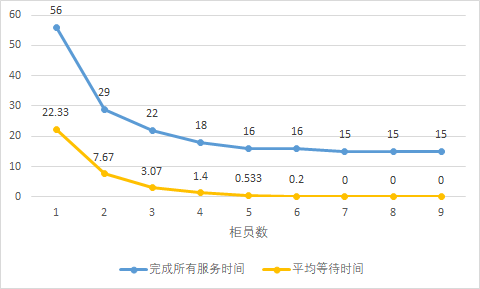

# 题目

银行有 n 个柜员负责为顾客服务，顾客进入银行先取一个号码，然后等着叫号。当某个柜员空闲下来，就叫下一个号。

编程实现该问题，用 P、V 操作实现柜员和顾客的同步。

## 实现要求

1. 某个号码只能由一名顾客取得；
2. 不能有多于一个柜员叫同一个号；
3. 有顾客的时候，柜员才叫号；
4. 无柜员空闲的时候，顾客需要等待；
5. 无顾客的时候，柜员需要等待。

## 实现提示

1. 互斥对象：顾客拿号，柜员叫号；
2. 同步对象：顾客和柜员；
3. 等待同步对象的队列：等待的顾客，等待的柜员；
4. 所有数据结构在访问时也需要互斥。

## 测试文本格式

测试文件由若干记录组成，记录的字段用空格分开。记录第一个字段是顾客序号，第二字段为顾客进入
银行的时间，第三字段是顾客需要服务的时间。

下面是一个测试数据文件的例子：

```
1 1 10
2 5 2
3 6 3
```

## 输出要求

对于每个顾客需输出进入银行的时间、开始服务的时间、离开银行的时间和服务柜员号。

## 实验报告内容要求

- 写出设计思路和程序结构，并对主要代码进行分析；
- 实际程序运行情况；
- 对提出的问题进行解答；
- 体会或者是遇到的问题。


# 解答

## 设计思路

按照题目要求，本题需要编写一个程序来模拟银行的叫号服务系统。以下将从

### 顾客与柜员

因为该系统涉及的两方主体为顾客和柜员，故我们可以从这两个方面入手进行分析。

从顾客的角度，整个过程按顺序分为：

1. 到达银行，取号进入队列
2. 等待柜员叫号
3. 接受服务
4. 离开

从柜员的角度，整个过程按顺序分为：

1. 若无叫号队列中无顾客，则没有动作
2. 若叫号队列中有顾客且自身空闲，则叫最前面的号
3. 服务顾客
4. 重复以上操作

细致分析以上流程，可以发现问题的关键是处理好一系列互斥与同步问题，即

- 叫号队列这一资源在任意时刻只能被一个实体所占有。不同顾客取号进入队列的操作是互斥的，不同柜员从队列中取出顾客的操作是互斥的，顾客和柜员对队列的操作也是互斥的
- 顾客和对其提供服务的柜员需要同步

因为顾客的每个实体的行为是相同的，柜员的每个实体的行为也是相同的，所以自然可以采用面向对象的思想，将其抽象为两个类。顾客和柜员的行为可以用独立的线程来表述，此时问题就具体化为线程间的互斥和同步问题。

### 时间的模拟和统计

这里单独用一小节来说明时间的模拟和统计问题，因为我认为这是非常重要但又被很多人忽视或者错误地理解的问题。在本题中给出了每位顾客进入银行的时刻和所需要服务的时间，那么应当如何正确地模拟这些时间，从而在最后正确地给出每个顾客接受服务的时刻呢？

一个看起来直观的想法是通过调用 `sleep` 让线程休眠指定的时间来模拟服务的时长，使用用户接受服务时的系统时钟时刻减去程序开始运行时的基准时间来得到用户接受服务的时刻。但我认为这样做是既不正确也不合适的，尽管某些情况下也能得到正确的结果。原因如下：

- `sleep` 使线程休眠的时间并不一定精确地等于指定的时长。存在误差积累导致最后统计的时间偏离正确答案的可能。
- `sleep` 使线程休眠了，我们想要得到答案就必须等待较长的时间。

那么，怎样模拟与统计时间才是正确的呢？在这里我提出一种将时间离散化的方式。当然，这样就又引入了一系列线程间同步问题。下面简单地介绍这一模型。

#### 离散时间模型

离散时间模型具有自己的时钟 $t$，$t$ 的取值是离散的。这里我们取为自然数，即

$$ t = 0, 1, 2, \dots $$。

每一个时钟间隙是最小的时间单元。我们将按照这样的时间单元来分配线程的工作、统计时间的长度。从时间单元的尺度来看，所有的线程与时钟同步。只有当所有线程都完成了当前单元内的工作，时钟才会进入到下一个时间单元。

实际编程中，通过设置一对信号量来完成时钟与线程的同步，python 语言的示例如下：

`sync_threads` 中的每个线程具有 `wait_tick` 和 `wait_tock` 信号量，且初值为 0。每个线程中运行的过程是：

```python
def tick(self):
  while True:
    self.wait_tick.acquire()
    # DO SOMETHING HERE ...
    self.wait_tock.release()
```

离散时钟运行的过程是：

```python
while True:
  time += 1
  for th in sync_threads:
    th.wait_tick.release()
  for th in sync_threads:
    th.wait_tock.acquire()
```

这样即实现了上述功能。

## 程序结构

程序主要包含三个类，即顾客类 `Customer`、柜员类 `Teller` 和表示整个银行服务的类 `Bank`。

### 银行服务类 `Bank`

`Bank` 包含的字段有

- 离散时钟 `time`
- 叫号队列 `queue` 与对应的锁 `mutex_queue`
- 存放顾客和柜员实例的数组 `customers` 与 `tellers`
- 记录已完成服务的顾客数的 `total_served` 与对应的锁 `mutex_total`。

`Bank` 的方法有 `start`, 即在启动银行的服务。顾客与柜员的线程将在离散时钟的同步下模拟服务的过程。当 `total_served` 的值等于总顾客数时，服务结束，输出结果。

### 顾客类 `Customer`

`Customer` 类包含的字段有

- 顾客的序号 `no`
- 进入银行时间 `t_in`
- 需要服务的时长 `duration`
- 接受服务的时间 `t_serve`
- 所属的银行对象 `bank`
- 提供服务的柜员号 `teller_no`
- 用于与时钟同步的信号量 `wait_tick` 和 `wait_tock`
- 线程 `_thread` 和用于结束线程的事件 `done`。

`Customer` 类包含的方法有

- `tick`: 这是线程的入口函数。将在离散时钟的同步下，于指定时刻取号（即加入队列）
- `enqueue`: 加入队列
- `start`: 启动线程
- `stop`: 结束线程

### 柜员类 `Teller`

`Teller` 类包含的字段有

- 柜员的序号 `no`
- 所属的银行对象 `bank`
- 当前服务的顾客 `_current_customer`
- 用于与时钟同步的信号量 `wait_tick` 和 `wait_tock`
- 线程 `_thread` 和用于结束线程的事件 `done`。

`Teller` 类包含的方法有

- `tick`: 这是线程的入口函数。将在离散时钟的同步下，在满足条件时叫号。
- `start`: 启动线程
- `stop`: 结束线程

## 代码实现

本次实验使用 Python 3.7，利用 `threading` 模块中的 `Lock` 和 `Semaphore` 实现锁和信号量，利用 `Thread` 与 `Event` 来实现与控制多线程。完整的程序代码如下：

```python
import argparse
from threading import Event, Thread, Semaphore, Lock

DEBUG = False  # 是否输出调试信息


class Bank:
  """表示银行服务的类"""
  def __init__(self):
    self.time = 0
    self.queue = []  # 顾客的等待队列及其锁
    self.mutex_queue = Lock()
    self.customers = []
    self.tellers = []
    self.total_served = 0  # 已完成服务的人数及其锁
    self.mutex_total = Lock()

  def start(self):
    """启动银行服务"""
    # 绑定顾客到本银行，启动每个顾客的线程
    for customer in self.customers:
      customer.bank = self
      customer.start()

    # 绑定柜员到本银行，启动每个柜员的线程
    for teller in self.tellers:
      teller.bank = self
      teller.start()

    # 离散时钟
    while self.total_served < len(self.customers):
      self.time += 1
      # 在一个时钟周期内，先运行所有顾客的线程
      for customer in self.customers:
        if not customer.done.is_set():  # 仅处理仍未完成服务的顾客
          customer.wait_tick.release()

      for customer in self.customers:
        if not customer.done.is_set():
          customer.wait_tock.acquire()

      # 再运行所有柜员的线程
      for teller in self.tellers:
        teller.wait_tick.release()

      for teller in self.tellers:
        teller.wait_tock.acquire()

    # 所有顾客已服务完毕（其线程已停止），此时停止所有柜员的线程
    for teller in self.tellers:
      teller.finish()

    # 输出结果
    for customer in self.customers:
      print("{} {} {} {} {}".format(customer.no, customer.t_in, customer.t_serve,
                      customer.t_serve + customer.duration, customer.teller_no))


class Customer:
  """顾客类"""
  def __init__(self, no, t_in, duration):
    self.no = no  # 顾客编号
    self.t_in = t_in  # 顾客进入银行的时间
    self.duration = duration  # 需要服务的时长
    self.t_serve = None  # 接受服务的时间
    self.bank = None  # 所属的银行对象
    self.teller_no = None  # 提供服务的柜员号
    self.wait_tick = Semaphore(0)  # 用于与时钟同步的一对信号量
    self.wait_tock = Semaphore(0)
    self.done = Event()  # 用于结束线程的事件
    self._thread = Thread(target=self.tick)
    self._thread.setDaemon(True)

  def enqueue(self):
    """加入队列"""
    self.bank.mutex_queue.acquire()  # lock customer queue
    self.bank.queue.append(self)
    if DEBUG:
      print('Time {}: Customer {} enters into queue'.format(self.bank.time, self.no))
    self.bank.mutex_queue.release()  # unlock customer queue

  def tick(self):
    while not self.done.is_set():
      self.wait_tick.acquire()
      if self.bank.time == self.t_in:  # 在对应的时间取号
        self.enqueue()
      self.wait_tock.release()
    self.wait_tock.release()  # 进程被结束时也需要释放信号量

  def start(self):
    self._thread.start()

  def finish(self):
    self.done.set()


class Teller:
  """柜员类"""
  def __init__(self, no):
    self.no = no  # 柜员编号
    self.bank: Bank = None
    self.wait_tick = Semaphore(0)
    self.wait_tock = Semaphore(0)
    self._current_customer: Customer = None  # 当前服务的顾客
    self.done = Event()
    self._thread = Thread(target=self.tick)
    self._thread.setDaemon(True)

  def tick(self):
    while not self.done.is_set():
      self.wait_tick.acquire()
      if self._current_customer is not None:
        # 如果当前有服务的顾客，则判断是否已服务完毕
        if self.bank.time == self._current_customer.t_serve + self._current_customer.duration:
          # 服务完毕，终止顾客线程，清除 _current_customer 以准备迎接下一顾客
          self._current_customer.finish()
          if DEBUG:
            print('Time {}: Teller {} finishes serving Customer {}'.format(
              self.bank.time, self.no, self._current_customer.no))
          self._current_customer = None
          self.bank.mutex_total.acquire()
          self.bank.total_served += 1
          self.bank.mutex_total.release()
      
      if self._current_customer is None:
        # 尝试叫号
        customer = None
        self.bank.mutex_queue.acquire()
        if len(self.bank.queue) > 0:
          customer = self.bank.queue.pop(0)
        self.bank.mutex_queue.release()

        if customer is not None:
          # 若成功叫号
          if DEBUG:
            print('Time {}: Teller {} starts serving Customer {}'.format(
              self.bank.time, self.no, customer.no))
          customer.t_serve = self.bank.time
          customer.teller_no = self.no

          # 如果用户所需的服务时长大于 1，则设为当前的用户。否则在本周期即完成了服务。
          if customer.duration > 1:
            self._current_customer = customer
          else:
            customer.finish()
            if DEBUG:
              print('Time {}: Teller {} finishes serving Customer {}'.format(
                self.bank.time, self.no, customer.no))
            self.bank.mutex_total.acquire()
            self.bank.total_served += 1
            self.bank.mutex_total.release()

      self.wait_tock.release()
    self.wait_tock.release()

  def start(self):
    self._thread.start()

  def finish(self):
    self.done.set()


def main():
  parser = argparse.ArgumentParser(
    description='This solves the "Bank Teller Service" problem.')
  parser.add_argument('filename', type=str, help='Filename of test case')
  parser.add_argument('n_teller', type=int, help='Number of teller')
  args = parser.parse_args()

  bank = Bank()
  load_customers(args.filename, bank)
  load_tellers(args.n_teller, bank)
  bank.start()


def load_customers(filename, bank: Bank):
  """加载顾客到银行中"""
  with open(filename) as f:
    lines = f.readlines()
    for line in lines:
      props = line.split()
      customer = Customer(int(props[0]), int(props[1]), int(props[2]))
      bank.customers.append(customer)


def load_tellers(number, bank: Bank):
  """加载柜员到银行中"""
  for k in range(number):
    bank.tellers.append(Teller(k + 1))


if __name__ == '__main__':
  main()
```

详细的代码分析请见注释。

## 实验结果

采用题目的样例输入，当柜员数为 2 时，结果如下：

```
1 1 1 11 1
2 5 5 7 2
3 6 7 10 2
```

可以看到，时刻 1 时，顾客 1 进入银行，立即被柜员 1 服务。时刻 5 时顾客 2 进入银行，立即被柜员 2 服务。时刻 6 时顾客 3 进入了银行，但此时柜员皆处于忙碌状态，顾客 3 只能等待叫号。时刻 7 时，顾客 2 的服务完成，柜员 2 立即叫号顾客 3 开始服务。时刻 10 时顾客 3 的服务完成，时刻 11 时顾客 1 的服务完成。

不妨多次尝试运行，可以发现会有不同的结果：

```
1 1 1 11 2
2 5 5 7 1
3 6 7 10 1
```

这正是多线程程序的特点，即因为调度的不确定性可能产生不同的结果。

采用一个更复杂的输入，此时柜员数为 3。输入为：

```
1  1  5
2  5  7
3  3  3
4  4  6
5  10  3
6  7  1
7  12 5
8  7  6
9  4  1
10 9  2
```

程序输出如下：

```
1 1 1 6 1
2 5 6 13 2
3 3 3 6 2
4 4 4 10 3
5 10 13 16 3
6 7 10 11 3
7 12 13 18 1
8 7 7 13 1
9 4 6 7 1
10 9 11 13 3
```

可以将本程序第 4 行的 `DEBUG` 设置为 `True` 输出过程，例如上面的过程是：

```
Time 1: Customer 1 enters into queue
Time 1: Teller 1 starts serving Customer 1
Time 3: Customer 3 enters into queue
Time 3: Teller 2 starts serving Customer 3
Time 4: Customer 4 enters into queue
Time 4: Customer 9 enters into queue
Time 4: Teller 3 starts serving Customer 4
Time 5: Customer 2 enters into queue
Time 6: Teller 1 finishes serving Customer 1
Time 6: Teller 1 starts serving Customer 9
Time 7: Teller 1 finishes serving Customer 9
Time 6: Teller 2 finishes serving Customer 3
Time 6: Teller 2 starts serving Customer 2
Time 7: Customer 8 enters into queue
Time 7: Customer 6 enters into queue
Time 7: Teller 1 starts serving Customer 8
Time 9: Customer 10 enters into queue
Time 10: Customer 5 enters into queue
Time 10: Teller 3 finishes serving Customer 4
Time 10: Teller 3 starts serving Customer 6
Time 11: Teller 3 finishes serving Customer 6
Time 11: Teller 3 starts serving Customer 10
Time 12: Customer 7 enters into queue
Time 13: Teller 1 finishes serving Customer 8
Time 13: Teller 2 finishes serving Customer 2
Time 13: Teller 1 starts serving Customer 5
Time 13: Teller 2 starts serving Customer 7
Time 13: Teller 3 finishes serving Customer 10
Time 16: Teller 1 finishes serving Customer 5
Time 18: Teller 2 finishes serving Customer 7
```

# 思考题

## 柜员人数和顾客人数对结果分别有什么影响？

当柜员人数一定时，一般情况下顾客人数越多，顾客的平均等待时间就越久，完成所有服务就越晚。当然这需要排除最后一个顾客非常晚才到银行等特殊情况。

当顾客人数一定时，一般情况下柜员数目越多，顾客的平均等待时间就越短，完成所有服务就越早。当然这也需要排除顾客出现过于稀疏、柜员数目多于顾客总数等特殊情况。可以知道当柜员的数目满足了任意时刻不会有顾客排队时，再增加柜员的数目将不会对结果造成影响。

使用 15 个顾客的数据进行实验：



可以看到，实验结果印证了我们得出的结论。


##	实现互斥的方法有哪些？各自有什么特点？效率如何？

### 禁止中断法

原理：由于 CPU 只有在发生时钟中断或者其他中断时才会进行进程切换，所以通过中断的控制可以实现互斥。进程在进入临界区之前执行 “关中断” 指令，中断被关闭之后，不会发生进程的切换，因而其他进程无法进入临界区，进程离开临界区之后执行开中断指令。

特点及效率：禁止中断法的优点是简单，但是禁止中断的权力本来只属于内核，将禁止中断的权力交给用户进程将导致系统的可靠性变差。这一方法也不使用于多处理器。

### 共享锁变量 

原理：设置一个共享锁变量 `lock`，当有进程在临界区内时 `lock = 1`，无进程在临界区内时 `lock=0`。对于一个进程，在进入临界区时，需要先判断 `lock` 是否为 `0`。如果为 `1`，则被阻塞直到临界区内的进程将 `lock` 置 `0` 退出临界区后，该进程才能将`lock` 置为`1` 并进入临界区。

特点及效率：存在是忙等待，因此效率低。同时可能违背 “任何两个进程不能同时处于临界区” 的条件。

### 严格轮转法
原理：设置一整型变量 `turn`，用于记录轮到哪个进程进入临界区。每个进程只有 `turn`的值与进程序号一致时，才能进入临界区。

特点及效率：严格轮转法要求两个进程严格轮流进入临界区，故可能违背 “临界区外运行的进程不得阻塞其他进程” 的条件。并且，该方法存在忙等待的问题，因而效率较低。

### Peterson 算法

原理：当一个进程想要进入临界区时，需要先调用 `enter_region` 函数，判断是否能够安全进入，不能则等待。当进程从临界区退出后，调用 `leave_region` 函数，允许其他进程进入临界区。

特点及效率：Peterson 算法解决了进程互斥访问临界区的问题，而且避免了严格轮转法 “进程严格轮流进入临界区” 的缺点，能够**正常地**工作。但是，该算法仍存在忙等待，效率较低。

### 信号量

原理：给临界资源设置一个互斥信号量 `Mutex`。当其为 `0` 时，表明临界资源被某一进程占用，其他进程无法获取临界资源；但是，当其被释放后值变为 `1`，其他进程如果检测到这一变化，就能占用临界资源。

### 其他

除此之外还有一些其他的实现互斥的方式：

- 硬件指令⽅法：适⽤于任意数⽬的进程，优点是简单，可以⽀持进程中存在多个临界区。缺点是存在忙等待，效率较低。
- 管程：具有模块化，封装较好等特点。效率较高，但它是一个编程语言概念，编译器必须要识别管程并用某种方式对其互斥做出安排。
- 消息传递：适用于不同机器间的通信。

# 实验感想

这次实验的过程是一个学习、思考、探索与收获的过程。除去完成本次实验的要求外，我认为采用对象化的设计和建立离散时钟的想法是本次实验中比较有亮点、也是我思考比较多的地方。
