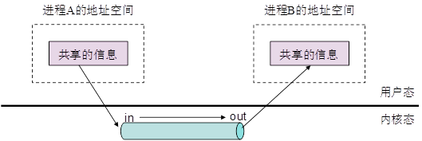
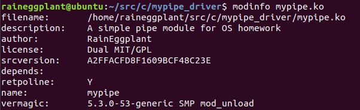
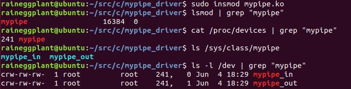
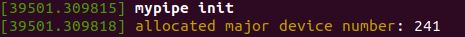
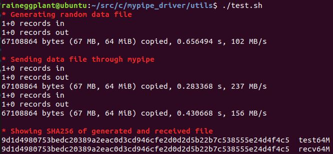
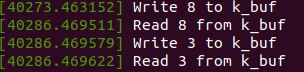
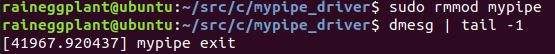

# 问题描述

管道是现代操作系统中重要的进程间通信（IPC）机制之一，Linux 和 Windows 操作系统都支持管道。

管道在本质上就是在进程之间以字节流方式传送信息的通信通道，每个管道具有两个端，一端用于输入，一端用于输出，如下图所示。在相互通信的两个进程中，一个进程将信息送入管道的输入端，另一个进程就可以从管道的输出端读取该信息。显然，管道独立于用户进程，所以只能在内核态下实现。



在本实验中，请通过编写设备驱动程序 mypipe 实现自己的管道，并通过该管道实现进程间通信。

你需要编写一个设备驱动程序 mypipe 实现管道，该驱动程序创建两个设备实例，一个针对管道的输入端，另一个针对管道的输出端。另外，你还需要编写两个测试程序，一个程序向管道的输入端写入数据，另一个程序从管道的输出端读出数据，从而实现两个进程间通过你自己实现的管道进行数据通信。

## 实验环境

操作系统平台可选 Windows 或 Linux，编程语言不限。

# 设计思路

我们在 Linux 内核为 5.3.0-53-generic 的 64 位 Ubuntu 18.04 上实现该管道驱动程序。

本次实验的管道可以采用字符设备实现。管道驱动程序加载后，创建 `mypipe_in` 和 `mypipe_out` 两个字符设备实例。其中 `mypipe_in` 支持 `write` 操作，`mypipe_out` 支持 `read` 操作。两个设备在内核中共用一个缓冲区，当写管道时，拷贝用户数据到缓冲区；当读管道时，从缓冲区向外拷贝数据。如此，便实现了管道驱动程序。

# 具体实现

## 模块、设备初始化

**初始化步骤如下：**

1. 利用 `alloc_chrdev_region` 分配设备号。我们为 `mypipe_in` 和 `mypipe_out` 两个设备申请设备号，其中主设备号交由系统分配，次设备号分别为 0 和 1。
2. 使用 `class_create` 创建 `mypipe` 设备类，以便之后向 `/dev` 下创建设备节点。
3. 使用 `cdev_init` 将两个字符设备与模块中定义的文件操作函数结构体 `mypipe_fops` 关联，再使用 `cdev_add` 向内核的 `cdev_map` 散列表中添加我们的字符设备。
4. 使用 `device_create` 在 `/dev` 下创建 `mypipe_in` 和 `mypipe_out` 设备。
5. 初始化用于缓冲区读写的互斥锁，初始化标记数据头尾的指针。

**文件操作函数结构体定义如下：**

```c
static struct file_operations mypipe_fops[2] = {
    {.owner = THIS_MODULE, .write = mypipe_write},
    {.owner = THIS_MODULE, .read = mypipe_read}};
```

注意到，这里允许多个进程同时打开设备，因此没有特别实现打开和关闭操作。同时可以看到，`mypipe_in` 只实现了 `write` 操作，`mypipe_out` 只实现了 `read` 操作，与其实际功能相对应。

**模块的初始化函数如下：**

```c
static int __init mypipe_init(void) {
  int ret = 0;
  struct device *dev;
  int i;

  printk(KERN_WARNING "mypipe init\n");

  // Allocate device number dynamicly. This can be viewed by running:
  //   cat /proc/devices
  ret = alloc_chrdev_region(dev_no, 0, 2, MODULE_NAME);
  if (ret < 0) {
    printk(KERN_ERR "failed to allocate device number!\n");
    goto alloc_err;
  }
  dev_no[1] = dev_no[0] + 1;
  printk(KERN_INFO "allocated major device number: %d\n", MAJOR(dev_no[0]));

  // Create device class
  mypipe_class = class_create(THIS_MODULE, MODULE_NAME);
  if (IS_ERR(mypipe_class)) {
    ret = PTR_ERR(mypipe_class);
    printk(KERN_ERR "class_create() failed\n");
    goto other_err;
  }
  mypipe_class->devnode = mypipe_devnode;

  for (i = 0; i < 2; ++i) {
    // Associate cdev with fop.
    cdev_init(&cdevs[i], &mypipe_fops[i]);
    // Add device to cdev_map table.
    ret = cdev_add(&cdevs[i], dev_no[i], 1);
    if (ret < 0) {
      printk(KERN_ERR "fail to add cdev\n");
      goto other_err;
    }
    // Create device node.
    dev = device_create(mypipe_class, NULL, dev_no[i], NULL, dev_names[i]);
    if (IS_ERR(dev)) {
      ret = PTR_ERR(dev);
      printk(KERN_ERR "device_create() failed\n");
      goto other_err;
    }
  }

  // Initialize mutexes and pointers.
  mutex_init(&m_access);
  mutex_init(&m_empty);
  mutex_init(&m_full);
  mutex_lock_killable(&m_empty);
  k_start = k_buf;
  k_end = k_buf;
  return 0;

other_err:
  // Unregister device number.
  unregister_chrdev_region(dev_no[0], 2);
alloc_err:
  return ret;
}
```

注意，这里通过设备类的 `devnode` 指定了设备的读写权限。为了让所有人可读写，将其权限指定为 `0666`。

```c
static char *mypipe_devnode(struct device *dev, umode_t *mode) {
  if (mode != NULL) *mode = 0666;
  return NULL;
}
```

## 模块、设备注销

**注销步骤如下：**

1. 使用 `device_destroy` 删除 `/dev` 下的设备节点，再使用 `cdev_del` 删除内核的 `cdev_map` 散列表中的字符设备。
2. 使用 `class_destroy` 销毁设备类。
3. 使用 `unregister_chrdev_region` 注销设备号。
4. 销毁用于缓冲区读写的互斥锁。

**具体代码如下：**

```c
static void __exit mypipe_exit(void) {
  int i;
  for (i = 0; i < 2; ++i) {
    device_destroy(mypipe_class, dev_no[i]);
    cdev_del(&cdevs[i]);
  }

  class_destroy(mypipe_class);
  unregister_chrdev_region(dev_no[0], 2);
  mutex_destroy(&m_access);
  mutex_destroy(&m_empty);
  mutex_destroy(&m_full);

  printk(KERN_WARNING "mypipe exit\n");
}
```

## 管道读写

我们设置了全局变量 `static char k_buf[BUFFER_SIZE]` 作为缓冲区，其大小为 4 KB，决定了管道中可以暂存的数据量。我们将缓冲区实现为循环队列，建立指针 `k_start` 和 `k_end` 分别指向有效数据的起始位置和末尾的下一个位置。

注意到，我们需要考虑缓冲区中的互斥读写以及缓冲区满或空的问题。首先，不能同时对缓冲区进行读写操作。其次，缓冲区满时，写操作应当被阻塞；缓冲区空时，读操作应当被阻塞。因此，我们设置了 `m_access`, `m_full` 和 `m_empty` 三个互斥锁来解决这些问题。

### 写操作

写操作的函数原型是

```c
static ssize_t mypipe_write(struct file *filp, const char __user *buf,
                            size_t count, loff_t *ppos)
```

当写操作成功时，返回写入的字符数量。否则返回负的表示错误的数值。如果缓冲区已满，则该操作将阻塞。

实现写操作时，我们首先判断待写入字符数是否为 0，若为 0 则可直接返回。否则，依次获取 `m_full` 和 `m_access` 互斥锁。注意代码中采用了支持 restartable system call 的方式。当我们拿到这两个锁时，说明缓冲区不是满的（注意这里同时排除了循环队列指针 `k_start` 与 `k_end` 相等时缓冲区满的可能！），且我们目前独占缓冲区，可以进行写入操作。

我们使用 `copy_from_user` 从用户空间的缓冲区 `buf` 向我们的缓冲区 `k_buf` 中拷贝数据。不过，对于 `k_buf` 中数据的不同分布情况，我们需要采用不同的逻辑。如果用 `.` 表示空闲区域，`#` 表示数据区域，`s` 表示 `k_start` 指针，`e` 表示 `k_end` 指针，则缓冲区中的数据存在如下两种分布可能：

1. `.....s#####e.....`
2. `#####e.....s#####`

对于第一种情况，我们需要先拷贝数据到数组的末端，如果此时还存在数据，则需要拷贝数据到数组的开头。对于第二种情况，则可以直接拷贝数据到数组中间的空闲部分。同时，我们最多拷贝到缓冲区满为止。如果拷贝结束后缓冲区未满，则应当释放互斥锁 `m_full`。

注意，只要进行了写入操作，则缓冲区将不再为空（已经在一开始排除了写入 0 个字符的情况），此时应当释放掉互斥锁 `m_empty`。

最后，我们再释放互斥锁 `m_access`, 并返回写入的字符数。

**具体代码如下：**

```c
static ssize_t mypipe_write(struct file *filp, const char __user *buf,
                            size_t count, loff_t *ppos) {
  size_t blank_front, blank_rear, blank_size;
  size_t write_size;

  if (count == 0) return 0;

  // acquire mutex m_full and m_access, support restartable system call.
  if (mutex_lock_interruptible(&m_full)) return -ERESTARTSYS;
  if (mutex_lock_interruptible(&m_access)) {
    mutex_unlock(&m_full);
    return -ERESTARTSYS;
  }

  // when executed here, k_buf is always empty if k_start == k_end
  // because of mutex m_full.
  if (k_start <= k_end) {
    // .....s#####e.....
    blank_rear = k_buf + BUFFER_SIZE - k_end;
    blank_front = k_start - k_buf;
    blank_size = blank_rear + blank_front;
    if (count <= blank_rear) {
      // only fill the rear end.
      if (copy_from_user(k_end, buf, count)) goto err_copy;
      write_size = count;
      mutex_unlock(&m_full);
    } else if (count < blank_size) {
      // fill the rear end and the front end.
      if (copy_from_user(k_end, buf, blank_rear)) goto err_copy;
      if (copy_from_user(k_buf, buf + blank_rear, count - blank_rear))
        goto err_copy;
      write_size = count;
      mutex_unlock(&m_full);
    } else {
      // fill all empty space.
      if (copy_from_user(k_end, buf, blank_rear)) goto err_copy;
      if (copy_from_user(k_buf, buf + blank_rear, blank_front)) goto err_copy;
      write_size = blank_size;
    }
  } else {
    // #####e.....s#####
    blank_size = k_start - k_end;
    if (count < blank_size) {
      if (copy_from_user(k_end, buf, count)) goto err_copy;
      write_size = count;
      mutex_unlock(&m_full);
    } else {
      if (copy_from_user(k_end, buf, blank_size)) goto err_copy;
      write_size = blank_size;
    }
  }

  k_end = k_buf + (k_end - k_buf + write_size) % BUFFER_SIZE;
  // printk(KERN_INFO "Write %zu to k_buf", write_size);
  mutex_unlock(&m_empty);
  mutex_unlock(&m_access);
  return write_size;

err_copy:
  printk(KERN_ERR "Error copy_from_user()");
  mutex_unlock(&m_full);
  mutex_unlock(&m_access);
  return -EINVAL;
}
```

### 读操作

读操作的函数原型是

```c
static ssize_t mypipe_read(struct file *filp, char __user *buf, size_t count,
                           loff_t *ppos)
```

当读操作成功时，返回读取的字符数量。否则返回负的表示错误的数值。如果缓冲区为空，则该操作将阻塞。

实现读操作时，我们首先判断待读取字符数是否为 0，若为 0 则可直接返回。否则，依次获取 `m_empty` 和 `m_access` 互斥锁。注意代码中采用了支持 restartable system call 的方式。当我们拿到这两个锁时，说明缓冲区不是空的（注意这里同时排除了循环队列指针 `k_start` 与 `k_end` 相等时缓冲区空的可能！），且我们目前独占缓冲区，可以进行读取操作。

我们使用 `copy_to_user` 从我们的缓冲区 `k_buf` 向用户空间的缓冲区 `buf` 中拷贝数据。不过，对于 `k_buf` 中数据的不同分布情况，我们需要采用不同的逻辑。和上一节相同，缓冲区中的数据存在如下两种分布可能：

1. `.....s#####e.....`
2. `#####e.....s#####`

对于第一种情况，我们可以直接从数组中间的数据部分拷贝数据。对于第二种情况，我们则需要先从数组的末端拷贝数据，如果此时还需要读取，则需要从数组的开头拷贝数据。同时，我们最多拷贝到缓冲区空为止。如果拷贝结束后缓冲区未空，则应当释放互斥锁 `m_empty`。

注意，只要进行了读取操作，则缓冲区将不再为满（已经在一开始排除了读取 0 个字符的情况），此时应当释放掉互斥锁 `m_full`。

最后，我们再释放互斥锁 `m_access`, 并返回读取的字符数。

# 实验结果

## 编译

内核模块需要使用 Makefile 编译：

```makefile
ifneq ($(KERNELRELEASE),)
	obj-m := mypipe.o
else
	KERN_DIR ?= /usr/src/linux-headers-$(shell uname -r)
	PWD := $(shell pwd)
default:
	$(MAKE) -C $(KERN_DIR) M=$(PWD) modules
endif

clean:
	$(MAKE) -C $(KERN_DIR) M=$(PWD) clean
```

编译输出的 `mypipe.ko` 为内核模块文件，可以通过 `modinfo` 命令查看其信息。



## 装载模块

使用 `insmod mypipe.ko` 装载模块后，可以使用如下命令查看模块是否加载、主设备号、设备类、设备节点信息。



同时，可以使用 `dmesg --follow` 实时查看模块的输出。



## 管道测试

### 测试一般数据通信


可以看到通过管道，我们完成了数据通信。

### 测试通过管道传输文件

运行测试脚本 `utils/test.sh`，其内容为：

```bash
echo -e '\e[31;1m* Generating random data file\e[m'
dd if=/dev/urandom of=test64M bs=64M count=1 iflag=fullblock

echo -e '\n\e[31;1m* Sending data file through mypipe\e[m'
dd if=test64M of=/dev/mypipe_in bs=64M count=1 iflag=fullblock &
dd if=/dev/mypipe_out of=recv64M bs=64M count=1 iflag=fullblock
wait

echo -e '\n\e[31;1m* Showing SHA256 of generated and received file\e[m'
sha256sum test64M recv64M

rm test64M recv64M
```

运行结果如下：



可以看到，我们的管道高效而无误地传递了数据。

### 测试缓冲区满或空

我们把 `BUFFER_SIZE` 修改为 8 来测试缓冲区满的情况。尝试向 `mypipe_in` 写入长度超过 8 byte 的数据，`echo` 果然被阻塞了：


这时再从 `mypipe_out` 中读取数据。可以看到数据被读出，`echo` 解除了阻塞，而 `cat` 又因为缓冲区变空而被阻塞。


查看此期间 `dmesg` 的输出（编译时取消注释了输出该调试信息的代码）：



可以看到的确按照我们的设计正常工作。

## 卸载模块

使用 `rmmod` 卸载模块。可以看到 `dmesg` 输出了相应信息。



此时再使用 `lsmod` 等指令均不再能看到 mypipe 相关的信息，证明成功卸载。

## 其他

题目要求编写的读写管道的程序在 `utils` 文件夹下，这里就不再单独演示了。

# 心得体会

本次实验是我第一次接触 Linux 驱动编程，不得不说，这和常规编程有着很不一样的思维方式和习惯。例如 `goto` 语句的使用，一开始我看到在内核编程中 `goto` 是发生错误时跳转的推荐方式时是很吃惊的，但在实际编程中，我的确体会到使用 `goto` 的好处：它使得错误处理代码不再会造成过多的嵌套，从而使代码结构清晰，可读性更好。因为是第一次接触，所以在编程过程中，我也查阅了很多相关的资料。总之，通过这次实验，我既加深了对于操作系统、驱动程序的理解，也扩展了知识面。
